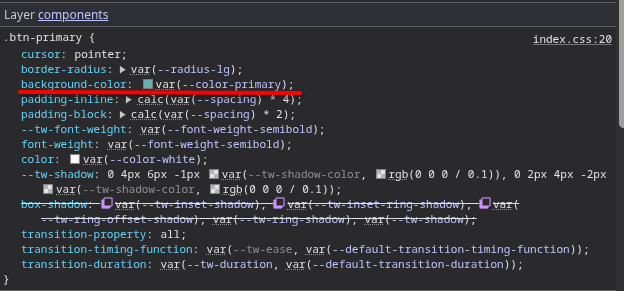
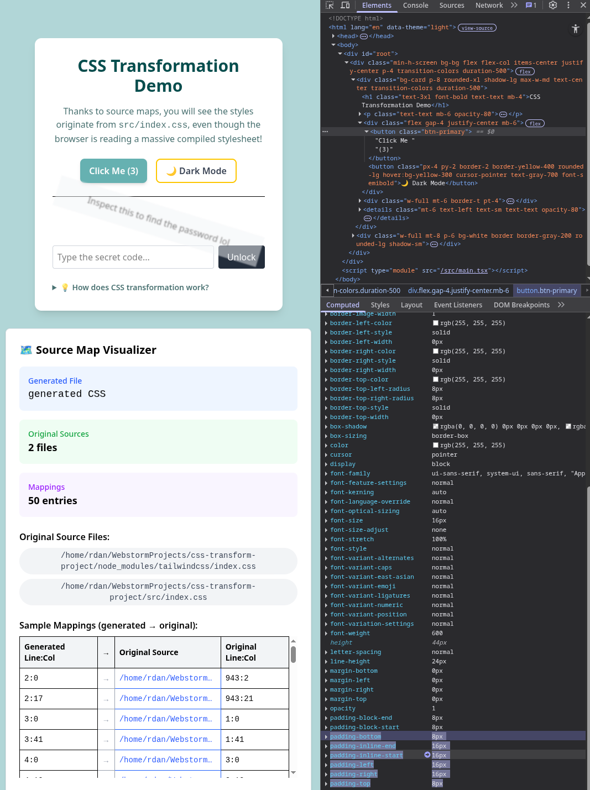
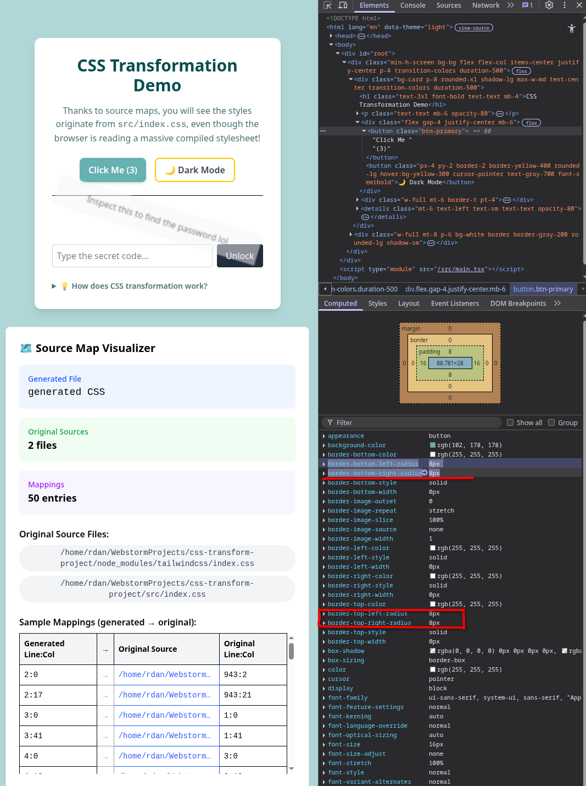
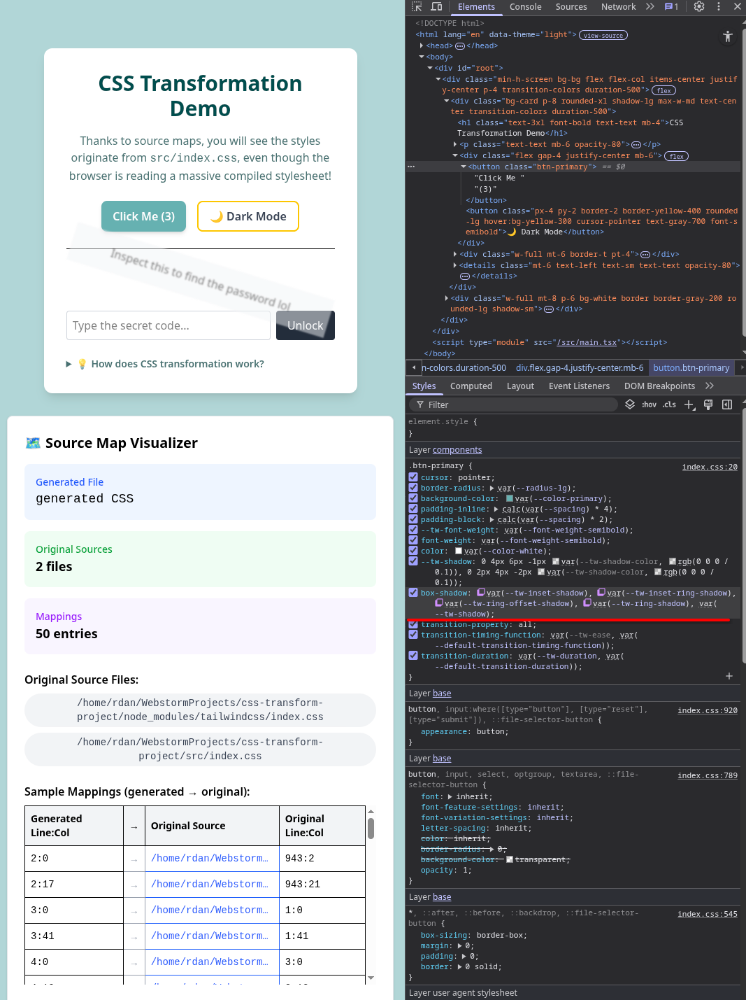
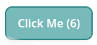
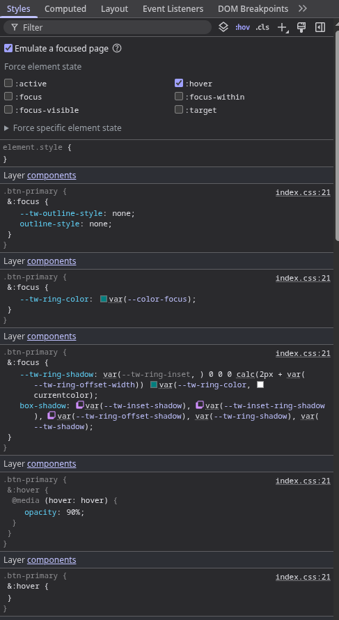

# DevTools CSS Investigation Report

## Overview

| Field | Value |
|---|---|
| **Element investigated** | `.btn-primary` — the "Click Me" button |
| **Framework** | React 19 + Tailwind CSS v4 |
| **Build tool** | Vite 6 with `css.devSourcemap: true` |
| **Browser** | Brave (since it's chromium-based) |
| **Authored source** | `src/index.css` |

## Authored CSS

The button is defined in `src/index.css` at lines 20–22:

```css
.btn-primary {
    @apply px-4 py-2 bg-primary text-white font-semibold rounded-lg shadow-md
           hover:opacity-90 focus:outline-none focus:ring-2 focus:ring-focus
           transition-all cursor-pointer;
}
```

All five properties below originate from this single `@apply` directive. The browser receives fully expanded standard CSS; the `@apply` syntax is never seen by the browser.


---

## Property Investigations

### Property 1: `background-color`

| Field | Value |
|---|---|
| **Computed value** | `rgb(102, 178, 178)` |
| **Styles panel rule** | `background-color: var(--color-primary)` |
| **Generated CSS location** | `index.css:20` |
| **Authored source location** | `index.css:6` — `--color-primary: #66b2b2` inside the `@theme` block (lines 3–9) |
| **Traceable to source?** | ✅ Yes — clicking the rule in the Styles pane navigated directly to `index.css` in the Sources panel. The variable `--color-primary` is authored, its hex value is readable, and the computed `rgb(102, 178, 178)` is a direct conversion of `#66b2b2`. The chain is unambiguous. |



---

### Property 2: `padding`

| Field | Value |
|---|---|
| **Computed values** | `padding-top: 8px`, `padding-bottom: 8px`, `padding-left: 16px`, `padding-right: 16px` |
| **Styles panel rules** | `padding-inline: calc(var(--spacing) * 4)`, `padding-block: calc(var(--spacing) * 2)` |
| **Generated CSS location** | `index.css:20` (the selector line) |
| **Authored source location** | `index.css:21` — `@apply px-4 py-2` |
| **Traceable to source?** | ⚠️ Partially — DevTools navigates to `index.css` but points to line 20 (the selector), not line 21 where `@apply px-4 py-2` is written. Additionally, `--spacing` is a Tailwind-internal custom property (default `0.25rem`) that does not exist anywhere in the authored CSS. The computed `16px` resolves as `calc(0.25rem * 4) = 1rem = 16px`, introducing a layer of indirection through a variable the author never declared. |



---

### Property 3: `border-radius`

| Field | Value |
|---|---|
| **Computed values** | `border-top-left-radius: 8px`, `border-top-right-radius: 8px`, `border-bottom-left-radius: 8px`, `border-bottom-right-radius: 8px` |
| **Styles panel rule** | `border-radius: var(--radius-lg)` |
| **Generated CSS location** | `index.css:20` (the selector line) |
| **Authored source location** | `index.css:21` — `@apply rounded-lg` |
| **Traceable to source?** | ⚠️ Partially — DevTools navigates to `index.css` but points to line 20, not to the specific `rounded-lg` utility on line 21. The variable `--radius-lg: 0.5rem` (also `--radius-xl: 0.75rem` visible in the inspector) is injected by Tailwind and has no counterpart in the authored CSS. The name `rounded-lg` and the variable name `--radius-lg` are inferable by convention, but no explicit mapping is shown. |



---

### Property 4: `box-shadow`

| Field | Value |
|---|---|
| **Computed value** | `rgba(0,0,0,0) 0px 0px 0px 0px` ×4, `rgba(0,0,0,0.1) 0px 4px 6px -1px`, `rgba(0,0,0,0.1) 0px 2px 4px -2px` |
| **Styles panel rule** | `box-shadow: var(--tw-inset-shadow), var(--tw-inset-ring-shadow), var(--tw-ring-offset-shadow), var(--tw-ring-shadow), var(--tw-shadow)` |
| **Generated CSS location** | `index.css:20` (the selector line) |
| **Authored source location** | `index.css:21` — `@apply shadow-md` |
| **Traceable to source?** | ❌ No — the Styles panel shows a composite value built from five `--tw-*` variables (`--tw-inset-shadow`, `--tw-inset-ring-shadow`, `--tw-ring-offset-shadow`, `--tw-ring-shadow`, `--tw-shadow`). None of these are authored. The actual shadow values are held inside `--tw-shadow`, which expands to the two-layer drop shadow that corresponds to Tailwind's `shadow-md` preset. This chain — authored utility → Tailwind variable → composite declaration → computed value — is not surfaced by DevTools at any step. |




---

### Property 5: Focus Ring

| Field | Value |
|---|---|
| **Computed value (unfocused)** | `--tw-ring-shadow: 0 0 #0000` |
| **Computed value (focused)** | `--tw-ring-color: #008080`, `--tw-ring-shadow: 0 0 0 2px #008080` |
| **Styles panel rules (focused)** | Three separate nested `&:focus` rule blocks inside `.btn-primary`, setting `outline-style: none`, `--tw-ring-color: var(--color-focus)`, and `--tw-ring-shadow: var(--tw-ring-inset,) 0 0 0 calc(2px + var(--tw-ring-offset-width)) var(--tw-ring-color, currentcolor)` plus a restatement of the full `box-shadow` chain |
| **Separate `:focus` rule visible in Styles panel?** | ✅ Yes — visible as nested `&:focus` blocks when the element is focused |
| **Generated CSS location** | `index.css:21` (the `@apply` line) |
| **Authored source location** | `index.css:21` — `@apply focus:ring-2 focus:ring-focus focus:outline-none` |
| **Traceable to source?** | ⚠️ Partially — the `:focus` rule blocks are visible and correctly point to `index.css:21`. However, the ring itself is still assembled through variable indirection: `--tw-ring-color` is set to `var(--color-focus)`, which resolves to `#008080`; `--tw-ring-shadow` is computed from a `calc()` expression using `--tw-ring-offset-width`; and the final visual effect is delivered by reusing the same `box-shadow` composite declaration from the base rule. The authored utilities `focus:ring-2` and `focus:ring-focus` map to three separate generated rule blocks, with no single declaration that reads "ring width = 2px, ring color = focus color". |





---

## Three Breakdown Cases

### Breakdown 1: Tailwind-Internal Variables

**Properties affected:** `padding`, `border-radius`, `box-shadow`

Tailwind CSS v4 injects custom properties such as `--spacing`, `--radius-lg`, `--tw-shadow`, and `--tw-inset-shadow` that do not appear anywhere in the authored `src/index.css`. These variables are used in the generated CSS rules and are visible in the Styles panel and Computed tab, but they have no authored source to link back to. A developer inspecting the Styles panel encounters variable names with no traceable origin within the project, breaking the chain from computed value back to authored intent.

**Example:** The computed `padding-left: 16px` resolves from `calc(var(--spacing) * 4)`. The variable `--spacing` is defined internally by Tailwind at `0.25rem`. It does not appear in `index.css`, cannot be clicked through to a source location, and is not referenced in any project file.

---

### Breakdown 2: `@apply` Line-Level Ambiguity

**Properties affected:** `padding`, `border-radius`, `box-shadow`, `focus-ring`

Every CSS property generated from `.btn-primary` points to the same source location: `index.css:20` — the line of the selector itself. The actual `@apply` directive is on line 21 and lists over ten utilities on a single line. DevTools cannot indicate which specific utility (`rounded-lg`, `shadow-md`, `px-4`, etc.) produced any given CSS declaration. All properties collapse to the same source pointer.

**Example:** `border-radius: var(--radius-lg)` and `box-shadow: var(--tw-inset-shadow)...` and `padding-inline: calc(var(--spacing) * 4)` all report `index.css:20` as their source. There is no way to determine from DevTools alone which part of the `@apply` line is responsible for which output declaration.

---

### Breakdown 3: One Utility, Multiple Generated Rule Blocks

**Properties affected:** `box-shadow` (focus ring state)

The authored utilities `focus:ring-2 focus:ring-focus focus:outline-none` appear as a single grouped expression on line 21 of `index.css`. In the generated CSS, Tailwind expands these into **three separate nested `&:focus` rule blocks**, each setting a different variable or property. None of these blocks directly states "ring width = 2px" or "ring color = focus color" — instead, `--tw-ring-shadow` is computed from a `calc()` expression using `--tw-ring-offset-width`, and `--tw-ring-color` is set to `var(--color-focus)` rather than a literal value. The final visual ring is then delivered by reusing the same `box-shadow` composite declaration from the base `.btn-primary` rule.

**Example:** The authored `focus:ring-2` alone produces a rule block that sets `--tw-ring-shadow: var(--tw-ring-inset,) 0 0 0 calc(2px + var(--tw-ring-offset-width)) var(--tw-ring-color, currentcolor)`. The `2` from `ring-2` is embedded inside a `calc()` expression mixed with another variable. Tracing why the ring is exactly 2px wide requires mentally parsing a generated expression rather than reading an authored value. All three generated blocks point to `index.css:21`, but no individual block corresponds to a single utility — the mapping is one-to-many and obscured by variable composition.
