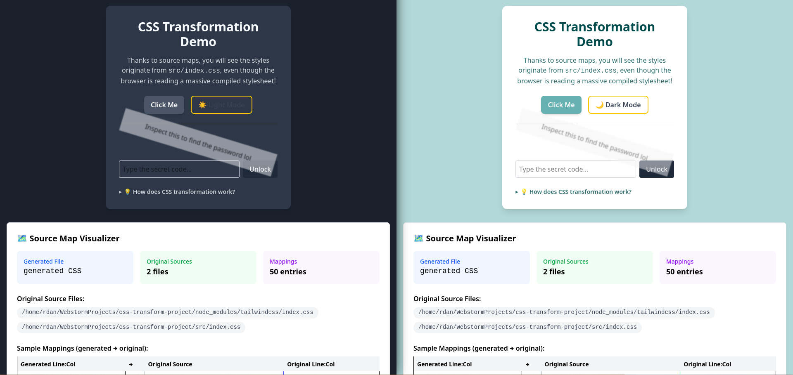
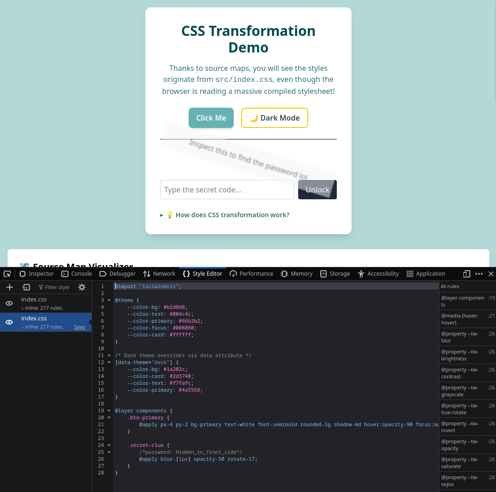
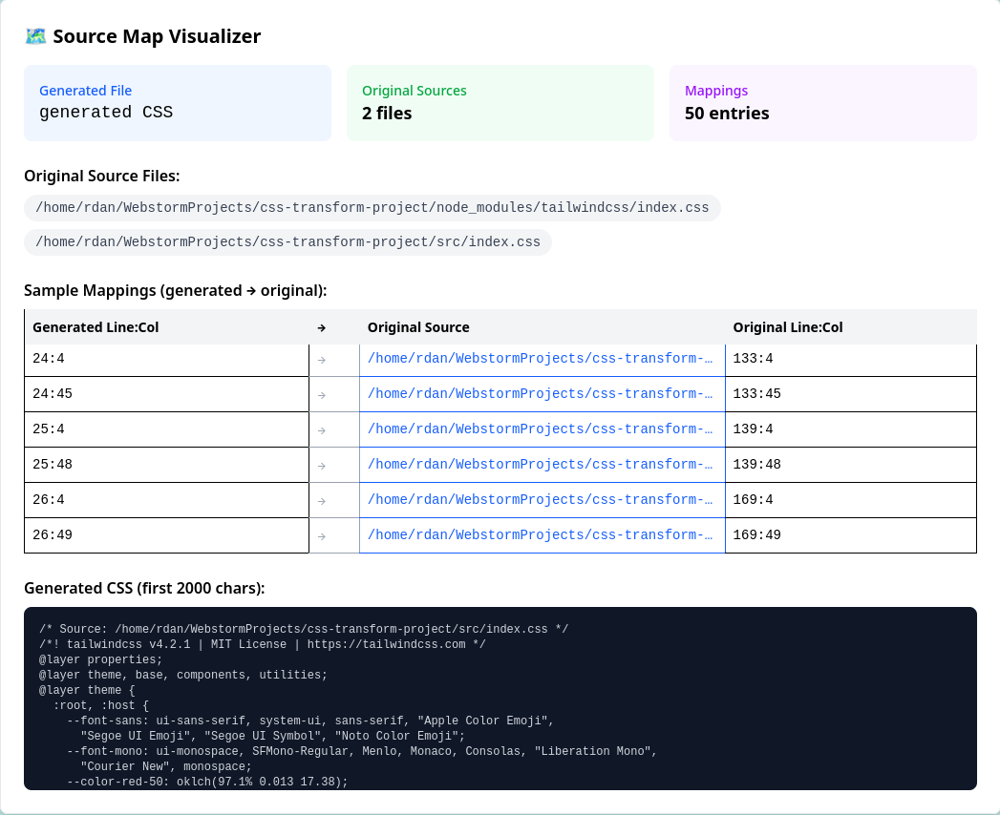
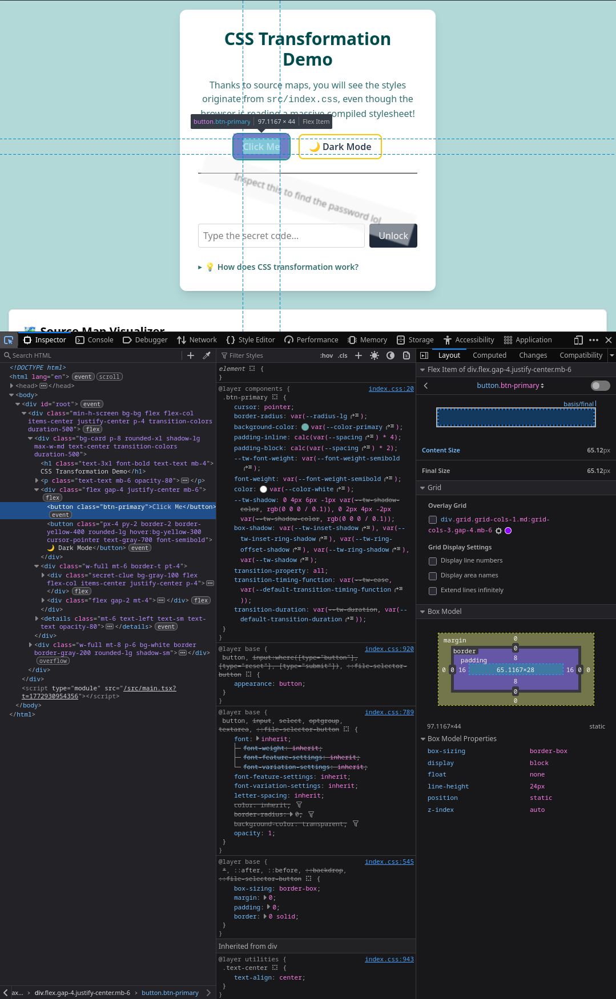

# CSS Transformation & Source Map Demo

A small interactive frontend project that demonstrates how authored CSS is transformed by a modern build pipeline and how **source maps** let you trace generated styles back to their original source files.

Built with **React 19**, **Vite 6**, **Tailwind CSS v4**, and **TypeScript**.



## Quick Start

```bash
git clone https://github.com/Dan-works-on-stuff/css-transform-project
cd css-transform-project
npm install
npm run dev
```

Open [http://localhost:5173](http://localhost:5173) in your browser.

> **Requirements:** Node.js v24.14.0 or later.

## Features

- **🎨 Theme Switcher** — Toggle between light (teal) and dark themes using CSS custom properties and a `data-theme` attribute. All color values are defined once in `src/index.css` via Tailwind's `@theme` directive.

- **🔐 Secret Password Challenge** — A blurred, rotated element hides a CSS comment containing a password. Use your browser's DevTools to inspect the element, find the password in the source-mapped CSS, and unlock the message.

  

- **🗺️ Source Map Visualizer** — An interactive UI component that reads the CSS source maps injected by Vite at dev time, showing:
  - Which original source files contributed to the generated CSS
  - The original source content (embedded via `sourcesContent`)
  - A mapping table showing generated line:column → original file line:column
  - A preview of the generated CSS output

  

## How CSS is Transformed

The CSS you author in `src/index.css` does **not** correspond 1-to-1 with the CSS the browser receives. Here's the transformation pipeline:

### 1. Authored CSS (`src/index.css`)
```css
@import "tailwindcss";

@theme {
    --color-primary: #66b2b2;
}

@layer components {
    .btn-primary {
        @apply px-4 py-2 bg-primary text-white font-semibold rounded-lg;
    }
}
```

### 2. Tailwind CSS v4 scans source files
The `@tailwindcss/vite` plugin uses the Oxide engine (Rust-based) to scan all `.tsx`, `.ts`, `.html` files for class names like `bg-bg`, `text-text`, `flex`, `p-4`, etc.

### 3. Transformation & expansion
- **`@import "tailwindcss"`** is replaced with Tailwind's base, components, and utilities layers
- **`@theme` tokens** are registered as CSS custom properties and made available as Tailwind utility classes (e.g., `--color-bg` → `bg-bg`)
- **`@apply` directives** are expanded into standard CSS properties (e.g., `@apply px-4 py-2` → `padding: 0 1rem; ...`)
- **Utility classes** found in source files generate corresponding CSS rules on-the-fly
- **Unused classes** are never generated (tree-shaking)

### 4. Output
The browser receives a single, fully expanded CSS stylesheet with no Tailwind directives, no `@apply`, and no `@theme` — just standard CSS. **Source maps** link every generated rule back to its location in the original authored file.

## Where to Find Generated CSS & Source Maps

| Environment | Generated CSS | Source Maps |
|---|---|---|
| **Development** (`npm run dev`) | Injected into the DOM via `<style data-vite-dev-id>` tags | Inline base64-encoded source maps inside each `<style>` tag (enabled by `css.devSourcemap: true` in `vite.config.ts`) |
| **Production** (`npm run build`) | Output as a single file in `dist/assets/*.css` | `.js.map` files in `dist/assets/` (CSS source maps depend on Tailwind v4 plugin support) |

### Verifying in DevTools
1. Open DevTools → **Elements** → **Styles** pane
2. Click on any style rule — the link on the right shows `index.css:XX` (the original source) instead of a generated filename
3. This is source maps in action: the browser uses the mapping data to show you where the style was *authored*, not where it was *generated*



## Project Structure

```
src/
├── main.tsx                          # App entry point
├── App.tsx                           # Root component, theme state
├── index.css                         # All authored CSS (theme, components)
└── components/
    ├── DemoCard.tsx                   # Main demo card with counter & theme toggle
    ├── SecretMessage.tsx              # Password challenge component
    └── SourceMapVisualizer.tsx        # Interactive source map inspector
```

## Tech Stack

| Tool | Role |
|---|---|
| **Vite 6** | Bundler — processes CSS, enables HMR, generates source maps |
| **Tailwind CSS v4** | Utility-first CSS framework — scans source, generates styles, expands `@apply` |
| **React 19** | UI framework |
| **TypeScript** | Type safety |
| **source-map-js** | Parses source maps at runtime for the visualizer component |
